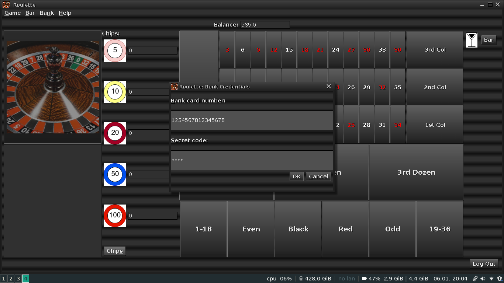

# Introduction

For the final module of the Human-Computer Interaction subject we were asked to create an application modeling a roulette of a casino. The objective of this game is to try guessing where the roulette's ball will fall, and betting based on your prediction.

The types of bets a player can make in this game are the following:

- Column bet: the player wins if the ball lands on the bet's column (wins 2x1)
- Dozen bet: the player wins if the ball lands on the bet's dozen (wins 2x1)
- Fail/Pass bet: the player wins if it guesses whether the ball passes (19-36) or fails (1-18) (wins 1x1)
- Number bet: the player wins if it guesses in which number the ball falls (wins 35x1)
- Odd/Even bet: the player wins if it guesses whether the ball falls on an even number or an odd number (wins 1x1)
- Red/Black bet: the player wins if it guesses whether the ball falls on a red number or a black number (wins 1x1)

The players use chips in order to bet. The available chips are of values: 5, 10, 20, 50 and 100.

Apart from playing, the users can also order drinks from the bar, and they are divided in alcoholic drinks and non alcoholic drinks.

Finally, the user can access a virtual bank in order to change in-game currency for chips or to transfer money from their bank accounts to be changed into in-game currency.

# Prototype

The initial prototype we developed for this application was the following one.

## GameWindow

GameWindow (View Figure 1) is the main window and therefore  central part of the application. It has the following modules:
 
- **Spinning wheel**: contains a timer and a progress bar specifying the time until the roulette is spinned, an image representing the wheel and a text area showing the results of the previous round.
- **Bets**: represented by a table showing the user's current bets for the current round, as well as a *Bet* button for placing them.
- **Chips**: list of all chip types followed by the number of chips of that type that the user has. Again, there is a *Chips* button for recharging them.
- **Balance**: user's current balance in euros.
- **Bar**: beberage icon alongside a *Bar* button that opens the bar view.
- **Log out**: button for logging out of the application.
- **Menu**: menu for quick access of every other module in the application.

{height=350px}

## SignInWindow

SignInWindow (View Figure 2) is a dialog with a form that manages the credentials of the user. The user must have already signed up before being able to log in using this view. If the user has not signed up yet, he can do so by clicking on the *Sign Up* button located in the *New User* section.

{height=350px}

## SignUpWindow

SignUpWindow (View Figure 3) is a dialog with a form that manages the starting credentials of the user. The user must introduce their username and a desired password. Note that two users **can not share the same username**.

{height=350px}

## BankWindow

BankWindow (View Figure 4) is a dialog with the user's current balance in euros and four buttons for:

- Recharging their *in-game* balance
- Get chips for the roulette.
- Transfer their *in-game* balance back to their bank account.
- Transfer chips to *in-game* balance.

{height=350px}

## BankCredentialsWindow

BankCredentialsWindow (View Figure 5) is a dialog that manages the user's bank account credentials each time they want to perform an operation related to their bank account.

{height=350px}

## RechargeWindow

RechargeWindow (View Figure 6) is a dialog with a form asking the user for the balance they want to extract from their account.

{height=350px}

## ChipsWindow

ChipsWindow (View Figure 7) is a dialog with all chip types and a correspondent spinner asking the user for the number of chips from each type they want to extract. Spinners will keep adding chips until the balance threshold is reached.

{height=350px}

## TransferWindow

TransferWindow (View Figure 8) is a dialog that lets the user transfer their *in-game* balance back to their bank account.

{height=350px}

## ChipsToBalanceWindow

ChipsToBalanceWindow (View Figure 9) is a dialog that lets the user transfer their chips to *in-game* balance.

{height=350px}

## BetWindow

BetWindow (View Figure 10) is a dialog that lets the user place their bets for the current round. It has the following components:

- A combo box with the different bets that the user can make. Depending on the selected one, the panel that manages the bet configuration will change for that specific type of bet.
- Dynamic configuration panel with the current bet details and a button for placing it.
- Text area showing all the bets the user has made for this round, with buttons for adding a bet, modifying it, removing it or removing all of them.
- Text fields informing the user for the total price of all current bets and the possible income if the user wins.

{height=350px}

## BarWindow

BarWindow (View Figure 11) is a dialog modeling the bar of the casino. It has a list of products for the user to select and add or remove to or from the cart, as well as the total price for the order and the user's current balance. The cart is shown as well with the information of all the products in the order with their respective units.

{height=350px}

## Changes applied after user tests

Lastly, the applied changes to the application after the results obtained from  user testing are listed:

- **Main Window**
    - Implemented a *Log Out* button that will show the current balance before closing the application.
    - Now we show the user's current balance.
    - Now we show a timer and a progress bar informing the user of the remaining time until next round.
    - Now we show a text area informing of the results of the previous round.
- **Bank Window**
    - Now the bank window is accessed from the *GameWindow* instead of appearing after the user logged in.
    - Now we have buttons for transfering in-game balance back to the user's bank account and for transforming chips into in-game balance.
    - Now when the *BankWindow* is closed we return to the *GameWindow*.
- **Chips Window**
    - The spinners for controling the number of chips will be disabled whenever the user does not have enough balance to afford said chip type.
- **Bet Window**
    - The configuration of each individual bet will be displayed in a dynamic panel that changes depending on the type of that specific bet.
    - Changed *Bet Window* components to reflect the previous change.

# Development aspects

## Interface

### SignInWindow

SignInWindow (View Figure 12). The main panel has a GridLayout with 1 column and then the buttons are inside two panels with a FlowLayout.

{height=350px}

#### Changes

There have been no changes in this window since the prototype phase.

### SignUpWindow

SignUpWindow (View Figure 13). The main panel has a GridLayout with 1 column and then the button is inside a panel with a FlowLayout.

{height=350px}

#### Changes

This window has changed since the prototype phase in order to ask for all the necessary information regarding the user who is registering for the first time.

### GameWindow

GameWindow (View Figure 14). This is the main window, and has a menu with different options. The main panel has a BorderLayout:

- In the **north** region we have a panel with a FlowLayout that represents the information of the user balance.
- In the **south** region we have a panel with a FlowLayout that contains the Log Out button.
- In the **west** region we have a panel with a GridLayout containing the roulette button and a text area for the results of the current round.
- In the **east** region we have a panel with a FlowLayout containing the bar section.
- In the **center** region we have a panel with a BorderLayout that contains the game elements, this being a panel for the chips and another panel with more panels for the representation of the board of the table of bets.    

{height=350px}

#### Changes

This window has changed since the prototype phase for being able to use drag and drop to play (Bet button has disappeared). Also, the menu not longer has a Chips menu item, this window is accesses via the bank window.

### BankWindow

BankWindow (View Figure 15). The main panel has a BorderLayout:

- In the **north** region we have a panel with a FlowLayout that represents the information of the user balance.
- In the **south** region we have a panel with a FlowLayout that contains the Finish button.
- In the **center** region we have a panel with a GridLayout that contains two panels, one for the actions regarding the chips and the other for actions regarding transfer of currency from the players' bank accounts.

{height=350px}

#### Changes

There has been some changes in this application as well, some buttons were removed because their functions were not in the requirements.

### ChipsWindow

ChipsWindow (View Figure 16). The main panel has a BorderLayout:

- In the **north** region we have a panel with a FlowLayout that represents the information of the user balance.
- In the **south** region we have a panel with a FlowLayout that contains the Ok and Cancel buttons.
- In the **center** region we have a panel with another BorderLayout that contains a label in the north position and a panel for the chips' icons and spinners.

{height=350px}

#### Changes

There was a small change, now the icons and spinners are all in one column instead of being in various columns.

### BankCredentialsWindow

BankCredentialsWindow (View Figure 17). The main panel has a GridLayout with 1 column and then the buttons are inside two panels with a FlowLayout.

{height=350px}

#### Changes

There have been no changes in this window since the prototype phase.

### RechargeWindow

RechargeWindow (View Figure 18). The main panel has a BorderLayout:

- In the **center** region we have a panel with a GridLayout that contains the form.
- In the **south** region we have a panel with a FlowLayout that contains the Ok and Cancel buttons.

{height=350px}

#### Changes

Now we do not show the amount of the user's bank account because it is not in the requirements.

### BarWindow

BarWindow (View Figure 19). The main panel has a BorderLayout:

- In the **center** region we have a panel with a GridLayout that contains two panels, one for the products (combobox, product icon, cart) and the other for the order actions (units' spinner, Add and Remove buttons, the order price, user balance and a text area for the user comments).
- In the **south** region we have a panel with a FlowLayout that contains the Ok and Cancel buttons.
- In the **west** region we have a panel with a GridLayout that contains the label and buttons in the product filtering section.

{height=350px}

#### Changes

It now has filtering options and a text area for the user comments, something specified in the requirements that we had not taken into account in the prototype phase.

### LogOutWindow

LogOutWindow (View Figure 20). The main panel has a BorderLayout:

- In the **center** region we have a panel with the button for transfering the in-game balance to the user's bank account.
- In the **north** region we have a panel with two labels and another panel with the user's balance.
- In the **south** region we have a panel with a FlowLayout that contains the Exit button.

{height=350px}

#### Changes

This interface did not exist in the prototype phase, but because of some requirements we have implemented it in the final version.

### More changes

Because of not being specifically referenced in the module's requirements, we have decided to remove some prototype interfaces. The ones that have been removed are:

- BetWindow (In the final version we use drag and drop to place bets)
- ChipsToBalanceWindow (Not specified in the requirements, unnecessary)
- TransferWindow (Not specified in the requirements, unnecessary)

## Business and Persistence layers

In this last part of the report, we will explain the business and persistence layers of the application.

### Business layer

#### Bar package

- *Order* (interface): models a bar order.
- *OrderImpl* (class): implements *Order* interface.
- **factory**
    - *BarManagerFactory* (interface): creates *BarManager* objects.
    - *BarManagerFactoryImpl* (class): implements *BarManagerFactory* interface.
    - *OrderFactory* (interface): creates *Order* objects.
    - *OrderFactoryImpl* (class): implements *OrderFactory* interface.
    - *ProductFactory* (interface): creates *Product* objects.
    - *ProductFactoryImpl* (class): implements *ProductFactory* interface.
- **managers**
    - *BarManager* (interface): manages products by communicating with the BarDataAccess interface from the persistence layer.
    - *BarManagerImpl* (class): implements *BarManager* interface. 
- **products**
    - *Product* (interface): models a bar product.
    - *Drink* (class): models a drink. Implements *Product* interface.

#### Bets package

- *Bet* (interface): models a bet.
- *BetImpl* (class): implements *Bet* interface.
- *BetStatus* (enum): represents bet status.
- **factory**
    - *BetFactory* (interface): creates *Bet* objects.
    - *BetFactoryImpl* (class): implements *BetFactory* interface.
    - *BetManagerFactory* (interface): creates *BetManager* objects.
    - *BetManagerFactoryImpl* (class): implements *BetManagerFactory* interface.
    - *BetTypeFactory* (interface): creates *BetType* objects.
    - *BetTypeFactoryImpl* (class): implements *BetTypeFactory* interface.
- **managers**
    - *BetManager* (interface): evaluates bets.
    - *ColumnManager* (class): models a column bet manager. Implements *BetManager* interface.
    - *DozenManager* (class): models a dozen bet manager. Implements *BetManager* interface.
    - *FailPassManager* (class): models a fail/pass bet manager. Implements *BetManager* interface.
    - *NumberManager* (class): models a number bet manager. Implements *BetManager* interface.
    - *OddEvenManager* (class): models an odd/even bet manager. Implements *BetManager* interface.
    - *RedBlackManager* (class: models a red/black bet manager. Implements *BetManager* interface.
- **types**
    - *BetType* (interface): models a bet type.
    - *ColumnType* (class): models a column bet type. Implements *BetType* interface.
    - *DozenType* (class): models a dozen bet type. Implements *BetType* interface.
    - *FailPassType* (class): models a fail/pass bet type. Implements *BetType* interface.
    - *NumberType* (class): models a number bet type. Implements *BetType* interface.
    - *OddEvenType* (class): models an odd/even bet type. Implements *BetType* interface.
    - *RedBlackType* (class): models a red/black bet type. Implements *BetType* interface.

#### Chips package

- *Chip* (interface): models a chip.
- *ChipImpl* (class): implements *Chip* interface.
- **factory**
    - *ChipFactory* (interface): creates *Chip* objects.
    - *ChipFactoryImpl* (class): implements *ChipFactory* interface.

#### Exceptions package

- **order**
    - *OrderException* (exception): custom exception for order errors.
- **users**
    - *UserException* (exception): custom exception for user errors.

#### Facade package

- *BarFacade* (class): simple interface for the gui that manages all classes from the business layer related to the development of the bar.
- *BetFacade* (class): same but for bet classes.
- *ChipFacade* (class): same but for chip classes.
- *ImageFacade* (class): same but for image classes.
- *UserFacade* (class): same but for user classes.

#### Images package

- *ImageFactory* (interface): creates *ImageIcon* objects for chips and products.
- *ImageFactoryImpl* (class): implements *ImageFactory* interface.

#### Player package

- *Player* (class): singleton class that models the current player of the application. Not the same as a user.
- **type**
    - *PlayerType* (interface): models a player type.
    - *DefaultPlayerType* (class): default player type. Implements *PlayerType* interface. 

#### Roulette package

- *Roulette* (class): singleton class that models the game's roulette. Works also as the *Subject* for the bets of the current round that act like an *Observer*.
- **results**
    - *RoundResult* (interface): models the result of the current round.
    - *RoundResultImpl* (class): implements *RoundResult* interface.

#### Users package

- *User* (interface): models a user of the application. As said before, it is not to be mistaken with a *Player*.
- *UserImpl* (class): implements *User* interface.
- **factory**
    - *UserFactory* (interface): creates *User* objects.
    - *UserFactoryImpl* (class): implements *UserFactory* interface.
    - *UserManagerFactory* (interface): creates *UserManager* objects.
    - *UserManagerFactoryImpl* (class): implements *UserManagerFactory* interface.
- **managers**
    - *UserManager* (interface): manages all things related to users, such as user credentials or communicating with the UserDataAccess interface from the persistence layer.
    - *UserManagerImpl* (class): implements *UserManager* interface.

### Persistence layer

#### Bar package

- *BarDataAccess* (interface): manages the products' file and communicates with the business layer related to the bar's development.
- *BarDataAccessImpl* (class): implements *BarDataAccess* interface.

#### Users package

- *UserDataAccess* (interface): manages the users' file and communicates with the business layer related to the users' management.
- *UserDataAccessImpl* (class): implements *UserDataAccess* interface.

